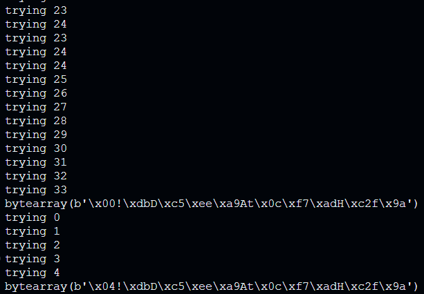

# Lab 1 Seguridad Computacional: Padding Oracle Attack
# Intergrantes: Edgar Morales, Jean Paul Duchens

### a) Estudio de ambos servicios
Tenemos que el servicio 1 cifra y el 2 descifra.
Probando diferentes largos de inputs para el servicio 1:
-"H" (texto plano de largo 1) -> clave de largo 112 bytes
-"Ho" (texto plano de largo 2) -> clave de largo 112 bytes
.
.
.
-texto plano de largo 9 -> clave de largo 128 bytes

Concluyendo que los bloques son de largo de 16 bytes por la manera en la que opera PKCS7 rellenando un nuevo bloque con padding.

Además pudimos observar que tenemos un largo límite del texto plano que se puede ingresar y por ende un largo límite del texto plano que nos da al descifrar, pues dando como texto plano la secuencia "aaaaa....." (256 bytes) logramos que el descifrador se desfazara y, que para nuevas peticiones se entregaran respuestas pasadas de bloques que no se lograron procesar a tiempo.

### b) Realizar el programa que envia un mensaje al servidor de encriptacion y responde al servidor de desencriptacion
Código adjunto en mainb.py, logramos encriptar y desencriptar efectivamente.

### c) Respuesta teorica sobre la estimacion del tamaño de bloques para un cifrador
Según lo analizado en la parte a), podemos inferir el tamaño del bloque del cifrador enviando mensajes de longitud creciente, agregando un byte a la vez, y observando los largos del texto cifrado. Cuando se detecte un incremento repentino en la longitud del texto cifrado, ese salto indica el tamaño del bloque utilizado.

## Main_god.py
### d) 
Código adjunto. Funciona perfectamente.
Se toma el mensaje cifrado en formato hexadecimal y se convierte a bytes. Luego, la función prueba todos los valores posibles (de 0 a 255) para el último byte del mensaje. Después de modificar el byte, se envía el mensaje al servidor para descifrar. Si la respuesta del servidor no contiene un error ("invalid"), el byte probado es válido. Finalmente, la función devuelve el valor correcto del último byte del mensaje.

### e) 
Código adjunto. Funciona perfectamente.
Se toma el bloque completo y se recorre de derecha a izquierda, es decir, desde el último byte hasta el primero. Para cada byte en el último bloque, la función prueba todos los valores posibles (de 0 a 255). Después de modificar cada byte, se reconstruye el mensaje cifrado y se envía al servidor de descifrado. Si la respuesta del servidor es válida (sin "invalid" ni "json"), el byte probado es correcto. La función construye la clave de forma byte a byte y la devuelve al final.

### f) 
Código adjunto. Tenemos algunos problemas con el ultimo byte del padding, vimos lo comentado en el foro de ucursos, pero no supimos realmente como implementarlo correctamente, de igual forma funcionó una vez, adjuntamos foto: 
